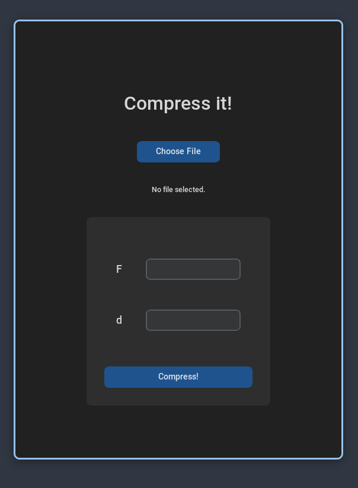
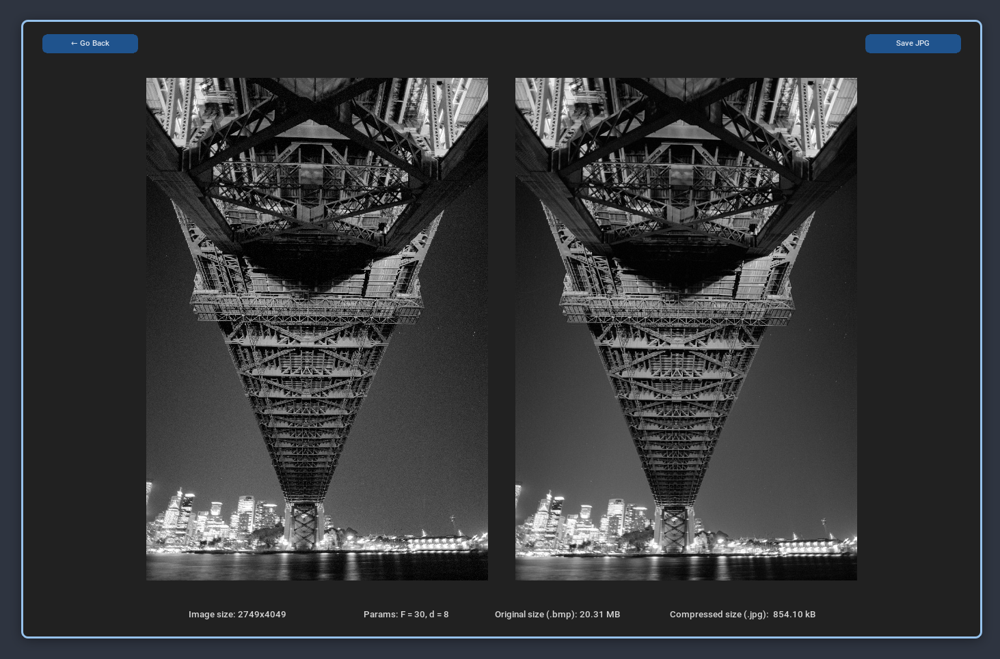

# CompressIt

CompressIt is a Python project for compressing grayscale .bmp images into JPEG-like .jpg images using the Discrete Cosine Transform (DCT). It features both a manual implementation of DCT and a fast implementation using SciPy, complete with performance benchmarking and a graphical user interface (GUI) built with CustomTkinter to allow users to specify compression parameters.

The project consists of two parts:

- Manual and fast DCT implementation and performance comparison.
- Image compression via DCT with a GUI for user interaction.

## Gallery
|  |  |
| :---------------------------: | :----------------------------------: |
|      Home Page      |         Image Viewer         |


## Repository Structure

The repository is organized as follows:

```
CompressIt/
├── app.py                     # GUI application launcher
├── dct/
│   ├── dct1D.py               # Manual 1D DCT and IDCT implementation
│   ├── dct2D.py               # Manual 2D DCT and IDCT implementation
│   └── image_compress.py      # JPEG-like compression logic
├── tests/
│   ├── test_dct1D.py          # Testing manual implementation of 1D DCT
│   ├── test_dct2D.py          # Testing manual implementation of 2D DCT
│   └── compare_dct.py         # Performance comparison between manual and SciPy's fast DCT
├── test_images/               # Sample .bmp images for testing
└── requirements.txt           # Python dependencies
```

## Compression tool usage

1. Clone the repository
2. Install the required dependencies:

   ```bash
   # Create virtual environment
   python -m venv venv
   source venv/bin/activate        # On Windows: venv\Scripts\activate

   # Install dependencies
   pip install -r requirements.txt
   ```

3. Run the application:
   ```bash
   python app.py
   ```
4. Use the GUI to select a grayscale .bmp image, specify the following parameters:
   - F: dimension of the DCT block. For example, F=8 means that DCT will be applied to 8x8 blocks of the image.
   - d: determines "how much compression" is applied. It means that for each DCT block, only only coefficients with indices (i, j) such that i + j < d will be kept, and the rest will be set to zero.
5. The compressed image will be shown side by side with the original image. User can save the compressed image as a .jpg file.
